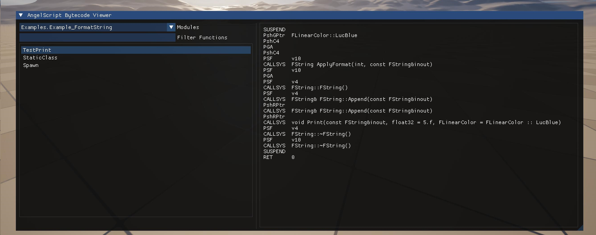
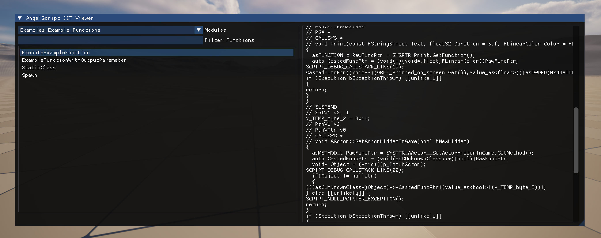
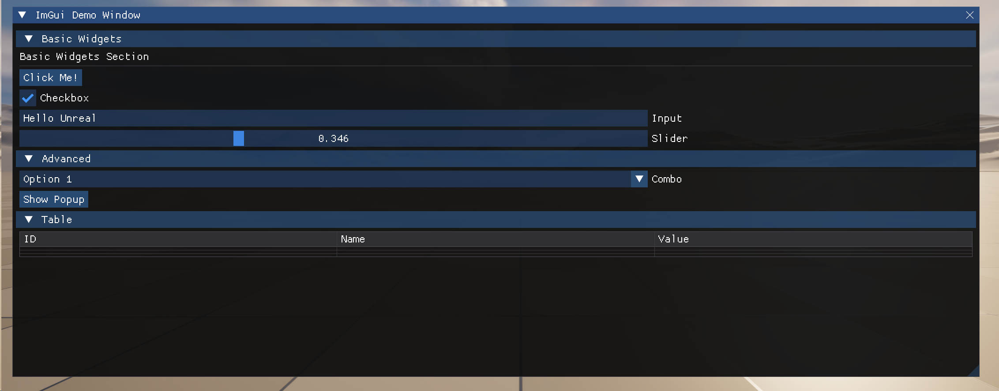
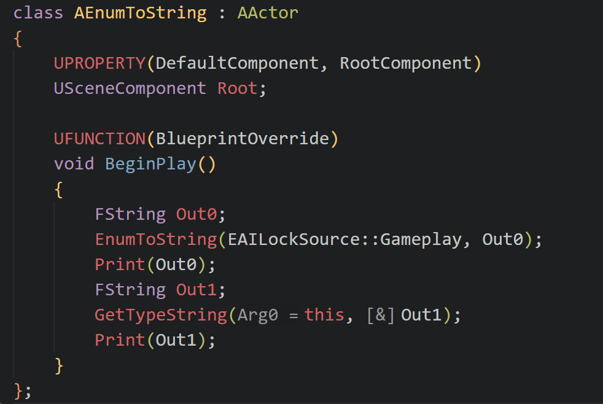

## Unreal Engine Angelscript Lab

[中文](./README-ZH.md)


### GMP Binding

A very powerful messaging system that supports notifications of arbitrary messages for arbitrary objects

[wangjieest/GenericMessagePlugin: A complete event system solution for Unreal Engine : Send or Receive Message everywhere!](https://github.com/wangjieest/GenericMessagePlugin)


### Dump bytecode

By running this command, you can Dump the specified module or the bytecode of the specified module

```
Dump.Angelscript.Bytecode
```

### Bytecode Viewer



### JIT Cpp Code Viewer



### ImGui in as



### EnumToString




****

[github.com/IDI-Systems/UnrealImGui](https://github.com/IDI-Systems/UnrealImGui)

[EnvarStudio/AngelscriptImGui: Angelscript binding for ImGui.](https://github.com/EnvarStudio/AngelscriptImGui/tree/main)
